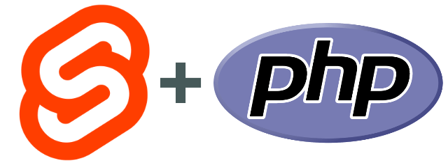

# PHP Backend for SvelteKit



## TL;TR

You can have PHP logic directly in SvelteKit route directory like this: `+page.server.php`

```PHP
<?php
function load(array $event) {
    $name = ($event['params']['name'] ?? 'unknownn');
    return [
        'message' => "Hello " . $name,
    ];
}
```

You can also use PHP to write `form actions` or `endpoint`.

- This plugin allows you to use SvelteKit the frontend of PHP backend.
- Not like the one which uses SvelteKit as an assets manager.
- No need to have a router in PHP side. SvelteKit is the router.
- No need to have Nginx as a front end of PHP-fpm. Plugin communicate directly with PHP-fpm.
- Of course, it's Composer compatible so that you can use any composer PHP packages inlcuding your own application logic.
- It is obvious but you cannot create `+page.php` because there's no PHP runtime in client environment.

## How to run demo

### Prerequirements:

- PHP with PHP fpm running
- composer for PHP packages
- Node.js

### Steps

1. cd to `example/`
2. `yarn` to install required packages.
3. `yarn dev --open` to launch dev server.

Try pages and take a look into the code in `src/routes`

### routes/php/[fruite]

> Example of page server load. The route parameters are passed to `+page.server.php`. Also it returns `$_SERVER` php variables for reference.

### routes/php/emoji/[fruite]

> Example of endpoing.

### routes/pherdle

> Example of form actions. Ported Sverdle to PHP.

## Motivation of This Project

You might ask, "Who uses PHP in 2023?"

Well, I do. And many projects in the world are using PHP by various reasons. I want to use modern client technology and I can use Svelte component in our app easiliy.

But not for SvelteKit. It's a complete web application framework and that's overlaps with the area PHP apps covers. As long as using PHP's routing feature, we cannot integrate SvelteKit's full power, such as unclear border between client and server, or prerendering during the build time.

With this plugin, you can connect your business logics written in PHP directly to SvelteKit's page logic. You can replace following code from PHP to SvelteKit:

- router
- controller
- page rendering

## No nginx required any more

Usually your PHP application is served via PHP-fpm. Because PHP-fpm doesn't talk HTTP by itself, you usually place nginx in front of PHP-fpm. This plugin uses `fastcgi-kit` npm package (which is written by me for this project :p ) to communicate directly with PHP-fpm.

On development phase, there's no need to launch PHP dev server any more. Just launch PHP-fpm service and any script will run from SvelteKit route. (Well, of course with under the ristriction of PHP-fpm security).

On production, you can replace `nginx` with node application (might be Express.js) to run SvelteKit application and every PHP call will be handled via FastCGI directly from the SvelteKit's page logic.

> Building will be supported in the next version.

## Frontend is easier to replace than backend

Suppose your codebase has been running for decades. Your app uses PHP for a historical reason. You are very passopnated to make the application modernized. What can you do?

Simple application is easy. You can rewrite the app from the scratch. But decent size of application includes many business logics in the code.

Frontend trends such as user interface changes quickly but your businness logic isn't. At lease those changes should be unrelated to the frontend trends.

## Lisence

MIT
